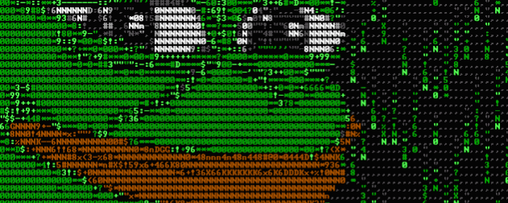

<h1 align="center">Hi guys 👋🏻, I'm Eric.</h1>

👔 Do you want to make a project with me?

🎮 A curiosity about me! I love games.

<h2 align="left">🌌 Technologies and tools</h2>

<h2 align="left">💡 GitHub Stats</h2>

